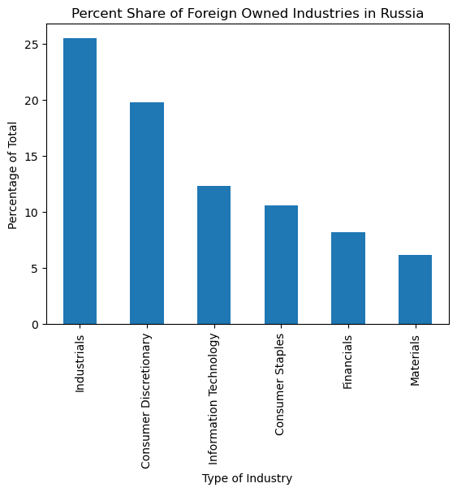
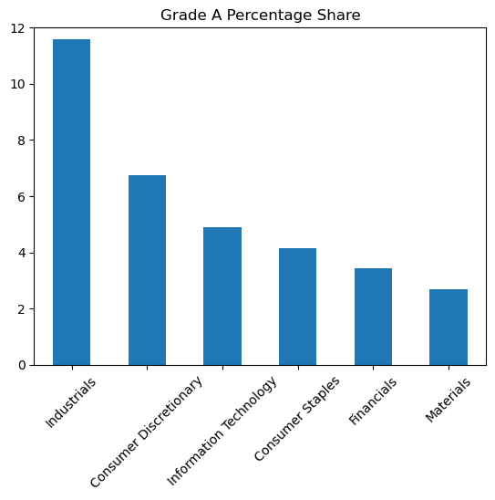
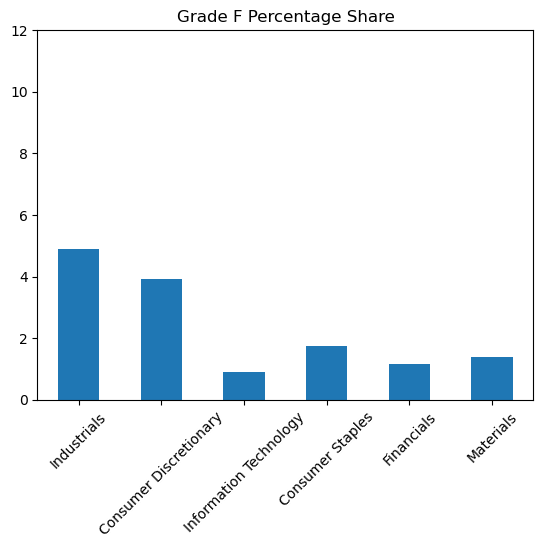
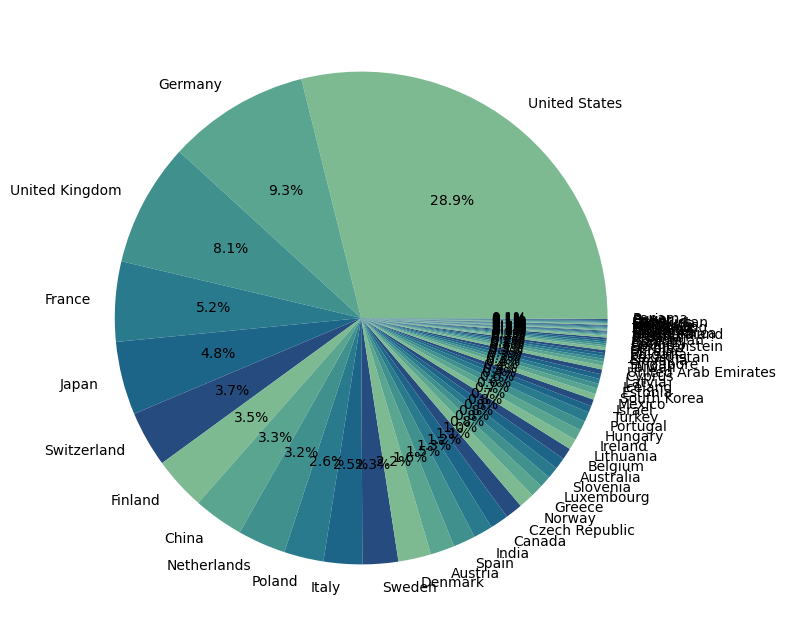
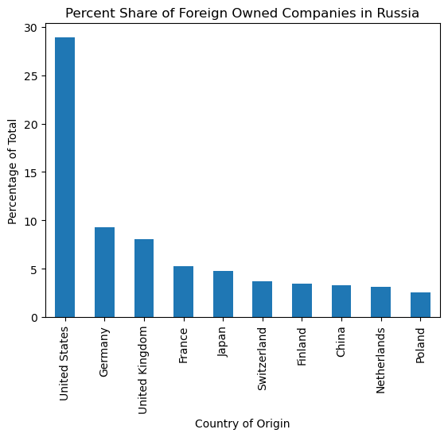
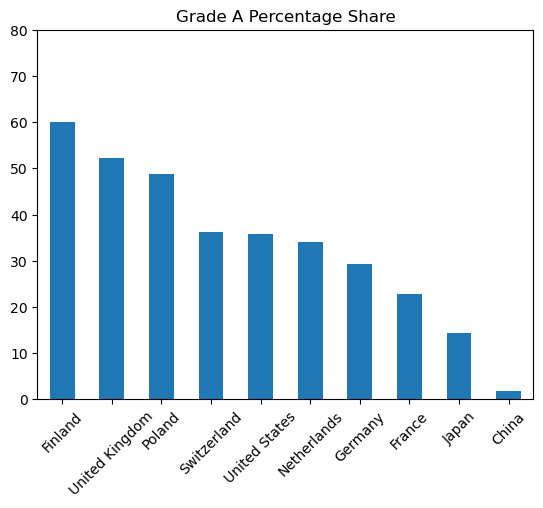
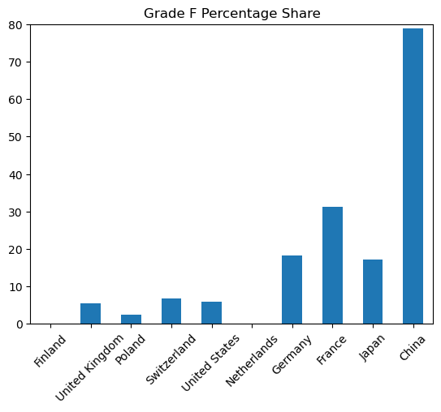

# Companies in Russia After the Invasion
### Exploring the response of different companies following the Russian invasion of Ukraine.

### Initial research question to analyze the dataset to look for correlations between the type of industry and their decisions to leave the country or stay following Russia's invasion of Ukraine.

### Stakeholder interest lies in the development of sanctions regimes to identify which sectors or regions can be targeted to apply political and or economic pressure on Russia.

## Exploratory Data Analysis

### Initially explored data based on the number of companies in each sector.  This was not very revealing as industrial companies were the largest in A grade and F grade.  Transitioned to evaluation based on percentage comparisons.

### All 12 industries was visually noisy so I condensed this down to the top 6 industries

#### Industrials: 25.49
#### Consumer Discretionary: 19.80
#### Information Technology: 12.33
#### Consumer Staples: 10.56
#### Financials: 8.22
#### Materials: 6.14
#### In total these industries compose 82.54% of all foreign-owned companies in Russia.

### Next I broke down the percentage by industry for each letter grade to illuminate differences across industries to see if one industry were better than another at divesting of Russian assets: 

## Visualizations:

### As a late addition I created a visualization to display the total number of companies broken down by industry in a pie chart

### This was too much data to work with and communicate seamlessly so I condensed my focus to the six biggest industries.

### Top six industries by percentage

### Percentage receiving grade "A"

### Percentage receiving grade "F"

### I found that industry comparison delivered inconclusive results.  I then switched to a comparison based upon the country in which companies are headquarted to explore the hypothesis that geopolitics may demonstrate a closer correlation with companies' operations in Russia.

## Country of Origin Analysis

### Similar to earlier code except this time filtering by "Country" column instead of "Industry".

### To ensure the most relevant of the 67 countries with companies in Russia I focused on the top 10 which showed the U.S., several European nations, and China:

#### United States: 457
#### Germany: 147
#### United Kingdom: 128
#### France: 83
#### Japan: 76
#### Switzerland: 58
#### Finland: 55
#### China: 52
#### Netherlands: 50
#### Poland: 41

### I focused the rest of my analysis on these 10 countries.

### Due to the large disparity between the number of businesses I focused on analyzing companies according to the percentage of a country's companies in Russia as a percentage of the total:

### Next I focused on comparing how each country performed and grouped by letter grade.

### Grade A
### The "custom_order" code again allowed for a cleaner human-readable comparison by letter grade.

## Visualizations:

### At a late addition I created a pie chart to show each country as a percentage of all companies in Russia.  I will use this as a starting point to contextualize the number of companies by country.

### Percentage of Foreign Owned Companies in Russia by top 10:

### Grade A Country Comparison

### Grade F Country Comparison

## Findings

### Comparing companies by country of origin shows inverted results when juxtaposing "A" and "F" grades with 60% of Finnish companies receiving "A" and less than 5% of Chinese companies receiving "A" whereas 0% of Finnish companies received an "F" and nearly 80% of Chinese companies received an "F". 

## Additional Visualization

### To further elucidate some of the findings I wanted to create a chart which showed which the number of companies that each country has in Russia.  I've decided to break this apart by industry in a stack chart as a proof of concept for my own capabilities.  

### I wanted to keep the order of countries consistent with the previous two charts for readability.  Together I believe that this helps "tell the story" of my findings and presents the honest caveat that, while we are talking about a relatively small number of companies which receive an "F", that this number is still revealing given the countries which similar numbers of companies and their received grades.

### This code groups countries and produces a count of how many companies there are in each industry.

### Count of Industries by Country

### My chosen colorscheme "crest" looks good with my chosen powerpoint presentation but is probably not very colorblind-friendly.  I am at peace with this because it is a proof of concept for my own ability and not essential to the meaning of my presentation.

## Conclusions

### This analysis suggests that geopolitics correlate closer to a company's decisions about its Russian market following the invasion of Ukraine than does the type of industry.  China is the outlier with a large number of companies in Russia which are maintaining operations since the invasion.  

### Current geopolitical signals reflect my findings in the data.  China received the most F grades for its companies which is supported by President Xi's claims of a "no limits" partnership with Russia.  Additionally, the second nation with the highest percentage of F grades, France, recently met with President Xi and spoke about the importance of not getting caught up in crises that are not [France's].  

### China has a similar number of companies as Finland and the Netherlands, but both have 0 companies which received an F grade.

### Caveat: It would take additional evaluation of the data itself to see how well the researchers have accounted for all nations and all companies in Russia.  Perhaps there was deliberate or accidental under/over counting of companies which distort the numbers, and this would be easy to do given the relatively small sample size.  

### A future research opportunity exists in measuring only companies that are state owned enterprises.

### A future research opportunity exists in identifying countries in the "global south" to see how they perform versus EU or NATO member countries.  

[def]: image.png